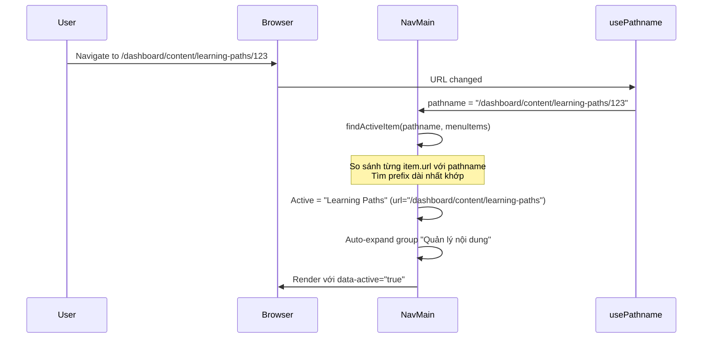

# Design Document: Admin Sidebar Restructure

## Overview

Tài liệu thiết kế này mô tả cách tái cấu trúc sidebar và hệ thống route của admin panel AlgoTutor. Mục tiêu là tổ chức lại navigation theo 5 nhóm chức năng quản trị rõ ràng, cập nhật cấu trúc route trong Next.js App Router, và đảm bảo tương thích ngược thông qua redirect.

### Phạm vi thay đổi

- **Component**: Refactor `AppSidebar`, `NavMain` — cập nhật cấu hình navigation groups
- **Routes**: Di chuyển và tạo mới các route dưới `/dashboard/content/` và `/dashboard/ai/`
- **Redirects**: Thiết lập permanent redirect (308) cho các route cũ
- **Responsive**: Tận dụng hệ thống responsive có sẵn từ shadcn/ui Sidebar

### Quyết định thiết kế chính

| Quyết định | Lựa chọn | Lý do |
|---|---|---|
| Cách thức redirect | `next.config.ts` redirects | Xử lý ở tầng server, không cần thêm middleware, hỗ trợ wildcard path |
| State management cho collapse | React state + `usePathname` | Đơn giản, không cần persist qua session vì yêu cầu chỉ giữ trong cùng tab |
| Active state logic | Longest prefix match | Chính xác hơn exact match, hỗ trợ nested routes |
| UI Library | Giữ nguyên shadcn/ui Sidebar + Base UI | Đã có sẵn trong project, đáp ứng đủ yêu cầu responsive |

## Architecture

### Kiến trúc tổng quan

```mermaid
graph TD
    subgraph "Dashboard Layout"
        A[layout.tsx] --> B[SidebarProvider]
        B --> C[SiteHeader]
        B --> D[AppSidebar]
        B --> E[SidebarInset - Content]
    end

    subgraph "AppSidebar"
        D --> F[SidebarHeader - Logo]
        D --> G[SidebarContent]
        D --> H[SidebarFooter - NavUser]
        G --> I[NavMain - 5 Groups]
    end

    subgraph "NavMain Logic"
        I --> J[usePathname]
        I --> K[isItemActive - Longest Prefix Match]
        I --> L[Collapsible Groups]
    end

    subgraph "Route Structure"
        M[/dashboard] --> N[/dashboard/content/*]
        M --> O[/dashboard/users/*]
        M --> P[/dashboard/ai/*]
        M --> Q[/dashboard/analytics]
        M --> R[/dashboard/settings]
    end
```

### Luồng xử lý Active State



## Components and Interfaces

### 1. Navigation Configuration (`src/config/navigation.ts`)

Tách cấu hình navigation ra file riêng để dễ bảo trì:

```typescript
import {
  LayoutDashboardIcon,
  LineChartIcon,
  GraduationCapIcon,
  BookOpenIcon,
  FileTextIcon,
  HelpCircleIcon,
  UsersIcon,
  ShieldIcon,
  BotIcon,
  TerminalSquareIcon,
  Settings2Icon,
} from "lucide-react"

export type NavItem = {
  title: string
  url: string
  icon: React.ReactNode
  items?: { title: string; url: string }[]
}

export type NavGroup = {
  label: string
  items: NavItem[]
}

export const navigationGroups: NavGroup[] = [
  {
    label: "Tổng quan",
    items: [
      { title: "Dashboard", url: "/dashboard", icon: LayoutDashboardIcon },
      { title: "Analytics", url: "/dashboard/analytics", icon: LineChartIcon },
    ],
  },
  {
    label: "Quản lý nội dung",
    items: [
      {
        title: "Learning Paths",
        url: "/dashboard/content/learning-paths",
        icon: GraduationCapIcon,
        items: [
          { title: "Tất cả", url: "/dashboard/content/learning-paths" },
          { title: "Tạo mới", url: "/dashboard/content/learning-paths/create" },
        ],
      },
      { title: "Topics", url: "/dashboard/content/topics", icon: BookOpenIcon },
      { title: "Lessons", url: "/dashboard/content/lessons", icon: FileTextIcon },
      { title: "Quizzes", url: "/dashboard/content/quizzes", icon: HelpCircleIcon },
    ],
  },
  {
    label: "Quản lý người dùng",
    items: [
      { title: "Users", url: "/dashboard/users", icon: UsersIcon },
      { title: "Roles & Permissions", url: "/dashboard/users/roles", icon: ShieldIcon },
    ],
  },
  {
    label: "AI & Công cụ",
    items: [
      { title: "AI Models", url: "/dashboard/ai/models", icon: BotIcon },
      { title: "Playground", url: "/dashboard/ai/playground", icon: TerminalSquareIcon },
    ],
  },
  {
    label: "Cài đặt hệ thống",
    items: [
      { title: "Settings", url: "/dashboard/settings", icon: Settings2Icon },
    ],
  },
]
```

### 2. Active State Utility (`src/lib/navigation-utils.ts`)

Logic xác định active state tách riêng để dễ test:

```typescript
/**
 * Xác định mục menu active dựa trên longest prefix match.
 * 
 * Rules:
 * - Exact match được ưu tiên cao nhất
 * - Nếu không có exact match, tìm item có URL là prefix dài nhất của pathname
 * - Đặc biệt: "/dashboard" chỉ active khi pathname === "/dashboard" (exact match only)
 *   để tránh nó luôn active cho mọi route
 * - Chỉ một item active tại một thời điểm
 */
export function findActiveItem(pathname: string, items: { url: string }[]): string | null {
  // Exact match first
  const exactMatch = items.find(item => item.url === pathname)
  if (exactMatch) return exactMatch.url

  // Longest prefix match (exclude root "/dashboard" from prefix matching)
  let longestMatch: string | null = null
  let longestLength = 0

  for (const item of items) {
    if (item.url === "/dashboard") continue // Root only matches exactly
    if (pathname.startsWith(item.url + "/") && item.url.length > longestLength) {
      longestMatch = item.url
      longestLength = item.url.length
    }
  }

  return longestMatch
}

/**
 * Kiểm tra một item cụ thể có active không.
 */
export function isItemActive(pathname: string, itemUrl: string): boolean {
  if (itemUrl === "/dashboard") {
    return pathname === "/dashboard"
  }
  return pathname === itemUrl || pathname.startsWith(itemUrl + "/")
}
```

### 3. Refactored NavMain Component

Cập nhật `NavMain` để sử dụng logic active state mới và hỗ trợ collapse/expand state persistence:

```typescript
"use client"

import { usePathname } from "next/navigation"
import { useState, useEffect, useCallback } from "react"
import Link from "next/link"
import { Collapsible, CollapsibleContent, CollapsibleTrigger } from "@/components/ui/collapsible"
import { SidebarGroup, SidebarGroupLabel, SidebarMenu, ... } from "@/components/ui/sidebar"
import { ChevronRightIcon } from "lucide-react"
import { isItemActive } from "@/lib/navigation-utils"
import type { NavGroup } from "@/config/navigation"

export function NavMain({ groups }: { groups: NavGroup[] }) {
  const pathname = usePathname()
  
  // Track expanded state per group - initialized based on active state
  const [expandedGroups, setExpandedGroups] = useState<Record<string, boolean>>(() => {
    const initial: Record<string, boolean> = {}
    groups.forEach(group => {
      const hasActiveItem = group.items.some(item => isItemActive(pathname, item.url))
      initial[group.label] = hasActiveItem
    })
    return initial
  })

  // Track which collapsible items are open
  const [expandedItems, setExpandedItems] = useState<Record<string, boolean>>(() => {
    const initial: Record<string, boolean> = {}
    groups.forEach(group => {
      group.items.forEach(item => {
        if (item.items?.length) {
          initial[item.url] = isItemActive(pathname, item.url)
        }
      })
    })
    return initial
  })

  const toggleItem = useCallback((url: string) => {
    setExpandedItems(prev => ({ ...prev, [url]: !prev[url] }))
  }, [])

  // Auto-expand group containing active item on navigation
  useEffect(() => {
    groups.forEach(group => {
      const hasActiveItem = group.items.some(item => isItemActive(pathname, item.url))
      if (hasActiveItem) {
        setExpandedGroups(prev => ({ ...prev, [group.label]: true }))
        // Also expand the active item's sub-items
        group.items.forEach(item => {
          if (item.items?.length && isItemActive(pathname, item.url)) {
            setExpandedItems(prev => ({ ...prev, [item.url]: true }))
          }
        })
      }
    })
  }, [pathname, groups])

  // ... render logic
}
```

### 4. AppSidebar Component (Updated)

```typescript
"use client"

import { NavMain } from "@/components/nav-main"
import { NavUser } from "@/components/nav-user"
import { navigationGroups } from "@/config/navigation"
import { Sidebar, SidebarContent, SidebarFooter, SidebarHeader, ... } from "@/components/ui/sidebar"

export function AppSidebar({ ...props }: React.ComponentProps<typeof Sidebar>) {
  return (
    <Sidebar className="top-(--header-height) h-[calc(100svh-var(--header-height))]!" {...props}>
      <SidebarHeader>{/* Logo */}</SidebarHeader>
      <SidebarContent>
        <NavMain groups={navigationGroups} />
      </SidebarContent>
      <SidebarFooter>
        <NavUser />
      </SidebarFooter>
    </Sidebar>
  )
}
```

**Thay đổi so với hiện tại:**
- Loại bỏ `NavSecondary` — Settings được đưa vào nhóm "Cài đặt hệ thống" trong `NavMain`
- Navigation config tách ra file `src/config/navigation.ts`
- Icon được truyền dưới dạng component reference thay vì JSX element (để config serializable)

### 5. Redirect Configuration

Thêm redirects vào `next.config.ts`:

```typescript
import type { NextConfig } from "next";

const nextConfig: NextConfig = {
  images: { /* existing config */ },
  async redirects() {
    return [
      {
        source: "/dashboard/learning-paths/:path*",
        destination: "/dashboard/content/learning-paths/:path*",
        permanent: true, // 308
      },
      {
        source: "/dashboard/models",
        destination: "/dashboard/ai/models",
        permanent: true, // 308
      },
    ]
  },
};

export default nextConfig;
```

**Lưu ý:** Next.js `redirects()` với `permanent: true` trả về status 308, tự động bảo toàn query parameters và fragments.

## Data Models

### Navigation Type Definitions

```typescript
// src/types/navigation.ts

export interface NavSubItem {
  title: string
  url: string
}

export interface NavItem {
  title: string
  url: string
  icon: React.ComponentType<{ className?: string }>
  items?: NavSubItem[]
}

export interface NavGroup {
  label: string
  items: NavItem[]
}
```

### Route Mapping

| Nhóm | Menu Item | Route | File Path |
|---|---|---|---|
| Tổng quan | Dashboard | `/dashboard` | `src/app/dashboard/page.tsx` |
| Tổng quan | Analytics | `/dashboard/analytics` | `src/app/dashboard/analytics/page.tsx` |
| Quản lý nội dung | Learning Paths | `/dashboard/content/learning-paths` | `src/app/dashboard/content/learning-paths/page.tsx` |
| Quản lý nội dung | Topics | `/dashboard/content/topics` | `src/app/dashboard/content/topics/page.tsx` |
| Quản lý nội dung | Lessons | `/dashboard/content/lessons` | `src/app/dashboard/content/lessons/page.tsx` |
| Quản lý nội dung | Quizzes | `/dashboard/content/quizzes` | `src/app/dashboard/content/quizzes/page.tsx` |
| Quản lý người dùng | Users | `/dashboard/users` | `src/app/dashboard/users/page.tsx` |
| Quản lý người dùng | Roles & Permissions | `/dashboard/users/roles` | `src/app/dashboard/users/roles/page.tsx` |
| AI & Công cụ | AI Models | `/dashboard/ai/models` | `src/app/dashboard/ai/models/page.tsx` |
| AI & Công cụ | Playground | `/dashboard/ai/playground` | `src/app/dashboard/ai/playground/page.tsx` |
| Cài đặt hệ thống | Settings | `/dashboard/settings` | `src/app/dashboard/settings/page.tsx` |

### Cấu trúc thư mục sau tái cấu trúc

```
src/app/dashboard/
├── page.tsx                          # Dashboard tổng quan
├── layout.tsx                        # Layout chung (sidebar + header)
├── analytics/
│   └── page.tsx
├── content/
│   ├── learning-paths/
│   │   ├── page.tsx                  # Di chuyển từ /dashboard/learning-paths/
│   │   ├── create/
│   │   │   └── page.tsx
│   │   └── [id]/
│   │       ├── page.tsx
│   │       ├── topics/
│   │       └── lessons/
│   ├── topics/
│   │   └── page.tsx                  # Tạo mới
│   ├── lessons/
│   │   └── page.tsx                  # Tạo mới
│   └── quizzes/
│       └── page.tsx                  # Tạo mới
├── users/
│   ├── page.tsx                      # Giữ nguyên
│   └── roles/
│       └── page.tsx                  # Tạo mới
├── ai/
│   ├── models/
│   │   └── page.tsx                  # Di chuyển từ /dashboard/models/
│   └── playground/
│       └── page.tsx                  # Tạo mới
└── settings/
    └── page.tsx                      # Giữ nguyên
```

## Correctness Properties

*Một property là một đặc tính hoặc hành vi phải đúng trong mọi trường hợp thực thi hợp lệ của hệ thống — về cơ bản là một phát biểu hình thức về những gì hệ thống phải làm. Properties đóng vai trò cầu nối giữa đặc tả dễ đọc cho con người và đảm bảo tính đúng đắn có thể kiểm chứng bằng máy.*

### Property 1: Active state longest prefix match

*For any* pathname và tập hợp menu items, hàm `isItemActive` SHALL trả về `true` cho đúng một item — item có URL khớp chính xác với pathname, hoặc nếu không có exact match thì item có URL là prefix dài nhất của pathname (với điều kiện URL root `/dashboard` chỉ match khi exact).

**Validates: Requirements 3.1, 3.3, 3.5**

### Property 2: Redirect path mapping preserves sub-paths

*For any* old route prefix (ví dụ `/dashboard/learning-paths`) và bất kỳ sub-path nào được nối thêm, hệ thống redirect SHALL ánh xạ đến new route prefix tương ứng (ví dụ `/dashboard/content/learning-paths`) trong khi giữ nguyên toàn bộ sub-path phía sau.

**Validates: Requirements 6.1, 6.2, 6.3**

### Property 3: Redirect preserves query parameters and fragments

*For any* redirect từ route cũ sang route mới, tất cả query parameters (`?key=value`) và URL fragments (`#section`) SHALL được bảo toàn nguyên vẹn trong URL đích.

**Validates: Requirements 6.4**

## Error Handling

### Route không tồn tại (404)

- Next.js App Router tự động hiển thị `not-found.tsx` khi truy cập route không có `page.tsx` tương ứng
- Tạo file `src/app/dashboard/not-found.tsx` để custom giao diện 404 trong dashboard context
- Sidebar vẫn hiển thị bình thường, không có item nào ở active state (theo Requirement 3.5)

### Import path errors sau khi di chuyển file

- Sau khi di chuyển route files, cần cập nhật tất cả relative imports
- Chạy `next build` để verify không có broken imports
- IDE TypeScript sẽ báo lỗi ngay nếu có import sai

### Redirect loops

- Đảm bảo không có redirect circular (route mới không trùng với source của redirect khác)
- Next.js sẽ throw error nếu phát hiện redirect loop trong config

### Responsive edge cases

- Sidebar component từ shadcn/ui đã xử lý sẵn:
  - Mobile: Render dưới dạng `Sheet` (overlay) với backdrop
  - Desktop: Render dưới dạng fixed sidebar
  - Transition giữa breakpoints được xử lý bởi `useIsMobile` hook

## Testing Strategy

### Unit Tests (Example-based)

| Test | Mô tả | Validates |
|---|---|---|
| Navigation config structure | Verify 5 groups với đúng items và URLs | Req 1.1-1.7 |
| Route accessibility | Verify mỗi route render đúng page | Req 2.1-2.12 |
| 404 handling | Verify route không tồn tại hiển thị 404 | Req 2.13 |
| Active state rendering | Verify `data-active="true"` attribute | Req 3.2 |
| Collapsible initial state | Verify chỉ group active được expand | Req 4.3 |
| Collapsible persistence | Verify state giữ nguyên khi navigate | Req 4.4 |
| Toggle animation | Verify transition duration ≤ 300ms | Req 4.1 |
| Mobile overlay behavior | Verify sidebar đóng sau khi chọn menu | Req 7.5 |

### Property-Based Tests

Sử dụng thư viện **fast-check** cho property-based testing trong TypeScript/JavaScript.

| Property | Mô tả | Iterations |
|---|---|---|
| Property 1 | Active state longest prefix match | 100+ |
| Property 2 | Redirect path mapping preserves sub-paths | 100+ |
| Property 3 | Redirect preserves query params & fragments | 100+ |

**Cấu hình:**
- Library: `fast-check` (phiên bản mới nhất)
- Minimum iterations: 100 per property
- Tag format: `Feature: admin-sidebar-restructure, Property {number}: {property_text}`

### Integration Tests

| Test | Mô tả |
|---|---|
| Build success | `next build` hoàn thành không lỗi sau tái cấu trúc |
| Redirect behavior | HTTP request đến route cũ trả về 308 với Location header đúng |
| Full navigation flow | Navigate qua tất cả menu items, verify page renders |

### Smoke Tests

| Test | Mô tả |
|---|---|
| File structure | Verify tất cả route files tồn tại ở vị trí mới |
| Sidebar renders | Verify sidebar hiển thị trên desktop và mobile |
