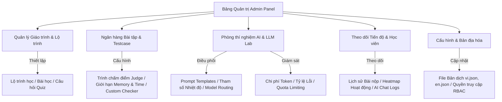

# Đề xuất Chức năng Hệ thống Quản trị (Admin Panel) - AlgoTutor

AlgoTutor là nền tảng học tập thuật toán và cấu trúc dữ liệu (DSA) đột phá được tích hợp trí tuệ nhân tạo (AI). Bản đề xuất dưới đây cung cấp thiết kế phân hệ quản trị toàn diện dành cho Quản trị viên (Admin), Biên tập viên nội dung (Content Creators), và Trợ giảng (Tutors) nhằm vận hành nền tảng một cách thông minh, tối ưu chi phí và nâng cao chất lượng đào tạo.

---

## 🗺️ Kiến trúc Tổng quan các Phân hệ Quản trị

Dưới đây là sơ đồ Mermaid thể hiện mối quan hệ giữa các phân hệ quản lý tại trang Admin với nhân hệ thống (Core Engine) và các dịch vụ AI / Trình chấm bài:

---

## 🚀 Chi tiết các Phân hệ & Chức năng Đề xuất

### 1. Phân hệ Quản lý Lộ trình & Giáo trình (Curriculum & Learning Paths)
*Mục tiêu: Giúp đội ngũ nội dung xây dựng các chặng học tập mạch lạc, kích thích tinh thần tự học từ cơ bản đến nâng cao.*

* **Trình Thiết kế Lộ trình Trực quan (Visual Path Builder):**
  * Giao diện Kéo - Thả (Drag & Drop) để xây dựng lộ trình học tập theo sơ đồ cây hoặc sơ đồ tuyến tính.
  * Phân chia lộ trình thành các **Chặng (Milestones)** -> **Chương (Modules)** -> **Bài học & Bài tập (Lessons & Problems)**.
* **Soạn thảo Bài học đa phương tiện (Rich Lesson Editor):**
  * Hỗ trợ viết bài học bằng Markdown kết hợp vẽ sơ đồ (Mermaid.js) và biểu thức toán học LaTeX (rất quan trọng khi viết công thức độ phức tạp thuật toán $O(N \log N)$ hoặc các công thức quy hoạch động).
  * Tích hợp khung xem trước (Live Preview) thời gian thực.
* **Thiết kế Quiz tương tác sinh động (Quiz Builder):**
  * Hỗ trợ nhiều loại câu hỏi: Trắc nghiệm (Single/Multiple Choice), Điền vào chỗ trống (Fill in the blanks), Sắp xếp các dòng Code để có chương trình hoàn chỉnh (Parsons Problems).
  * Gắn đáp án giải thích chi tiết có thể mở khóa sau khi học viên nộp bài.
* **Thiết lập Điều kiện tiên quyết (Prerequisites & Gatekeeping):**
  * Cấu hình điều kiện để mở khóa bài tiếp theo (ví dụ: Phải đạt tối thiểu 80% điểm số Quiz của bài trước, hoặc phải giải được ít nhất 2 bài tập DSA liên quan).

---

### 2. Phân hệ Quản lý Bài tập lập trình & Hệ thống chấm bài (Problem Bank & Judge System)
*Mục tiêu: Quản trị kho đề bài tập phong phú, quản lý bộ testcase bảo mật và cấu hình môi trường chấm bài.*

* **Trình soạn thảo đề bài chuẩn hóa (Problem Creator):**
  * Giao diện nhập thông tin: Tên bài, Mô tả đề bài (Markdown), Ràng buộc (Constraints), Ví dụ đầu vào/đầu ra (Input/Output Examples).
  * Phân loại nâng cao: Gắn thẻ thuật toán (Tags: `Dynamic Programming`, `Graph`, `Trie`...) và phân cấp độ khó trực quan (`Easy`, `Medium`, `Hard`).
* **Quản lý bộ Testcase nâng cao (Testcase Hub):**
  * Cho phép tải lên hàng loạt các file input/output dưới dạng file nén `.zip`.
  * Hỗ trợ cấu hình **Trọng số điểm** cho từng bộ testcase hoặc phân chia thành các nhóm testcase (Subtasks) để chấm điểm thành phần (rất phổ biến trong các kỳ thi Olympic tin học).
  * Thiết lập testcase công khai (học viên có thể xem khi chạy thử) và testcase ẩn (chỉ dùng khi chấm điểm chính thức).
* **Cấu hình Trình chấm & Giới hạn (Judge Settings & Custom Checkers):**
  * Thiết lập giới hạn thời gian chạy (Time Limit) và bộ nhớ (Memory Limit) cho từng ngôn ngữ riêng biệt (Ví dụ: Python có thể được cấu hình thời gian chạy gấp 2 lần C++).
  * Hỗ trợ **Custom Checker (Special Judge)** bằng C++ hoặc Python dành cho các bài toán có nhiều đáp án hợp lệ (ví dụ: Tìm đường đi ngắn nhất, xây dựng đồ thị thỏa mãn tính chất...).

---

### 3. Phân hệ AI Tutor & LLM Integration (Phòng thí nghiệm AI)
*Mục tiêu: Đột phá công nghệ bằng cách cho phép Admin tùy biến hành vi của Trợ lý học tập AI, kiểm soát chi phí token và đảm bảo AI không giải hộ học viên.*

* **Trình Quản lý Lời nhắc Hệ thống (System Prompt Playground):**
  * Cho phép chỉnh sửa Prompt nền cho từng tác vụ AI:
    * **AI Hint Generator:** Thiết lập hướng dẫn để AI chỉ đưa ra gợi ý gợi mở tư duy (Socratic method), hướng dẫn sửa lỗi logic/cú pháp mà tuyệt đối không viết sẵn Code hoàn chỉnh cho học viên.
    * **AI Advisor:** Định nghĩa cách AI phân tích hành vi và gợi ý lộ trình học tập tiếp theo.
  * Hỗ trợ kiểm thử Prompt trực tiếp (Playground) với nhiều cấu hình tham số khác nhau (Temperature, Top-P, Penalty).
* **Quản trị Luồng & Chuyển đổi Mô hình (Model Routing & Fallbacks):**
  * Cấu hình nhà cung cấp API (Google Gemini, OpenAI Claude, DeepSeek...).
  * Chế độ **Tự động Dự phòng (Smart Fallback)**: Khi API của mô hình chính (ví dụ: GPT-4o) bị quá tải hoặc đạt ngưỡng giới hạn băng thông, hệ thống tự động chuyển sang mô hình dự phòng (ví dụ: Gemini 1.5 Pro) để đảm bảo trải nghiệm người dùng không bị ngắt quãng.
* **Theo dõi Hiệu suất & Chi phí (AI Token & Cost Analytics):**
  * Biểu đồ thời gian thực về lượng Token đầu vào/đầu ra tiêu hao.
  * Ước tính chi phí vận hành AI quy ra USD theo từng ngày/tháng/năm.
  * Giám sát thời gian phản hồi (Latency) và tỷ lệ lỗi API của các nhà cung cấp để kịp thời điều chỉnh.
* **Cấu hình Hạn ngạch & Chống lạm dụng (Rate Limiting & Quotas):**
  * Đặt giới hạn số lượt hỏi AI trên mỗi học viên theo ngày/tháng (ví dụ: Tài khoản miễn phí được 10 lượt hỏi AI Hint/ngày, tài khoản Premium không giới hạn).

---

### 4. Phân hệ Quản lý Học viên & Theo dõi Tiến độ (Student Success & Progress)
*Mục tiêu: Giám sát toàn diện hành trình học tập để trợ giúp học sinh kịp thời.*

* **Bản đồ học tập cá nhân (Individual Progress Map):**
  * Xem tiến trình học tập dạng biểu đồ phần trăm hoàn thành lộ trình.
  * Biểu đồ tần suất học tập dạng **Heatmap đóng góp** (tương tự đồ thị commit của GitHub) để đánh giá độ chuyên cần của học viên.
* **Giám sát hoạt động giải bài (Submission Audit):**
  * Bảng theo dõi lịch sử nộp bài của học viên, hiển thị chi tiết mã nguồn họ đã viết, lỗi phát sinh cụ thể và các trường hợp kiểm thử (testcases) bị trượt.
* **Nhật ký Đàm thoại AI (AI Conversation Audit Logs):**
  * Cho phép Admin/Tutor xem lại các cuộc trò chuyện giữa học sinh và AI Tutor khi học sinh bấm nút "Yêu cầu Trợ giúp từ Giảng viên". Điều này giúp giáo viên hiểu ngay học sinh đang vướng mắc ở tư duy nào để giải thích chính xác nhất.

---

### 5. Phân hệ Giám sát Bài nộp & Chống gian lận (Global Submission & Anti-Cheat)
*Mục tiêu: Đảm bảo môi trường học tập công bằng, chất lượng và phát hiện sớm các hành vi bất thường.*

* **Bảng theo dõi thời gian thực (Real-time Submission Feed):**
  * Luồng bài nộp của toàn bộ hệ thống hiển thị trực quan (Live stream), giúp Admin theo dõi lượng tải hệ thống chấm bài.
* **Hệ thống Phát hiện Sao chép Code (Plagiarism Detector / Similarity Checker):**
  * Tích hợp công cụ so khớp mã nguồn tự động (sử dụng thuật toán so sánh cây cú pháp trừu tượng - AST hoặc tích hợp MOSS).
  * Quét định kỳ hoặc quét thủ công các bài nộp của cùng một bài toán để phát hiện các bài có độ tương đồng mã nguồn > 85%, đưa ra cảnh báo và gắn cờ gian lận (Flagged Submissions).

---

### 6. Phân hệ Phân tích & Báo cáo Nền tảng (Platform Intelligence)
*Mục tiêu: Cung cấp dữ liệu trực quan giúp ban quản trị định hướng phát triển sản phẩm.*

* **Phân tích Bài toán "Khó nuốt" (Drop-off Analysis):**
  * Chỉ ra các bài toán có tỷ lệ học sinh bỏ cuộc cao nhất (Ví dụ: Nộp sai quá 10 lần và không nộp lại nữa). Đây là cơ sở để đội ngũ học thuật viết lại đề bài trực quan hơn hoặc nâng cấp Prompt gợi ý của AI.
* **Thống kê hoạt động (DAU/WAU & Retention Rate):**
  * Đo lường lượng người dùng hoạt động hàng ngày, hàng tuần, và tỷ lệ học viên quay trở lại học sau 7 ngày, 30 ngày.
* **Báo cáo tài chính & đăng ký thành viên (Revenue & Subscription Reports):**
  * Theo dõi doanh thu từ các gói VIP/Premium, tỷ lệ chuyển đổi từ học viên miễn phí sang trả phí.

---

### 7. Phân hệ Cài đặt Hệ thống & Đa ngôn ngữ (System Settings & Localization)
*Mục tiêu: Đơn giản hóa việc quản lý cấu hình và dịch thuật ngôn ngữ cho dự án toàn cầu.*

* **Trình quản lý Bản dịch trực quan (Localization GUI Manager):**
  * Thay vì sửa thủ công file JSON phức tạp (`vi.json`, `en.json`), Admin có giao diện bảng để dịch các nhãn hệ thống. Hệ thống sẽ tự động đồng bộ và ghi lại file JSON chuẩn mà không sợ lỗi định dạng cú pháp.
* **Quản lý phân quyền dựa trên Vai trò (RBAC - Role-Based Access Control):**
  * Phân quyền chi tiết:
    * **Super Admin:** Toàn quyền hệ thống.
    * **Content Creator:** Soạn thảo lộ trình, bài giảng, quản lý ngân hàng câu hỏi và testcase, nhưng không xem được doanh thu hay cấu hình API AI.
    * **Tutor:** Xem tiến độ của học sinh, phản hồi các yêu cầu hỗ trợ và xem AI chat logs.

---

> [!TIP]
> **Khuyến nghị triển khai ưu tiên (Phase 1):**
> 1. **Phân hệ 1 & 2 (Lộ trình & Bài tập):** Đây là xương sống của AlgoTutor, cần ưu tiên hoàn thiện giao diện quản lý lộ trình học tập trực quan và tích hợp trình soạn thảo bài toán để đảm bảo luồng học tập cơ bản hoạt động.
> 2. **Phân hệ 3 (AI Tutor Lab):** AI là điểm đặc sắc nhất của AlgoTutor. Một giao diện quản lý Prompt và theo dõi Token sẽ giúp bạn tiết kiệm hàng nghìn USD chi phí API trong quá trình thử nghiệm thực tế.

> [!IMPORTANT]
> **Đảm bảo tính tối ưu hiệu năng:**
> Đối với bảng điều khiển Admin, việc tải hàng triệu bản ghi bài nộp (Submissions) hoặc Log chat AI sẽ gây chậm trễ hệ thống. Do đó, tất cả các bảng dữ liệu (Tables) trong các phân hệ trên cần được thiết kế hỗ trợ **Server-side Pagination**, **Debounced Search**, và **Lazy Loading** kết hợp cache (Redis/SWR/React Query).
