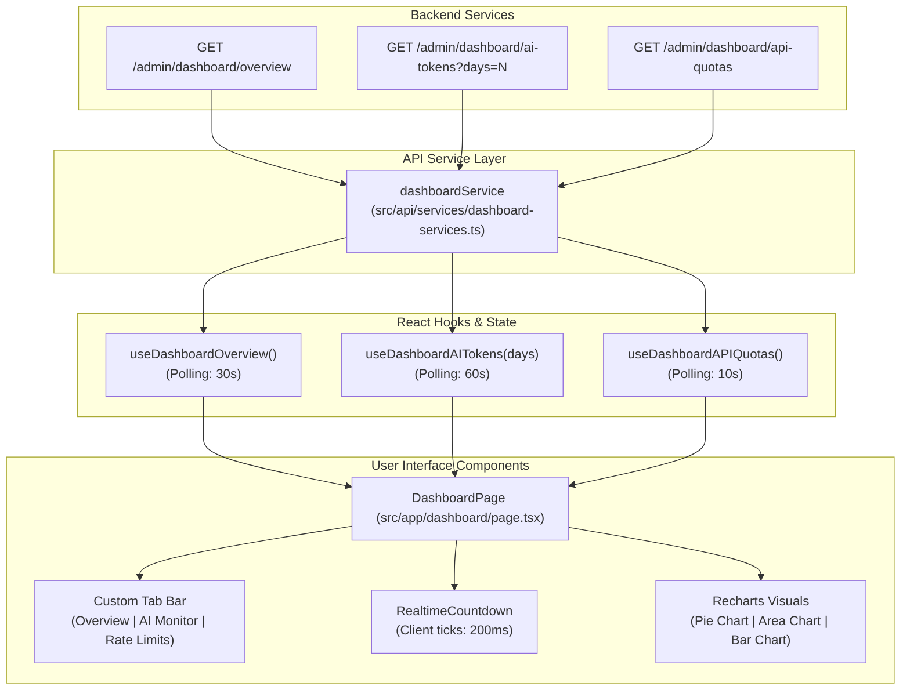

# Báo cáo Tái thiết kế Trang Dashboard - AlgoTutor Admin

Bản báo cáo này mô tả chi tiết kiến trúc, luồng tích hợp dữ liệu, các thành phần giao diện mới và cơ chế cập nhật thời gian thực (Real-time Sliding Window countdown) được áp dụng trong đợt nâng cấp giao diện Dashboard Admin dựa trên các API được cung cấp từ phía Backend (BE).

---

## 1. Bản đồ Kiến trúc & Luồng Tích hợp (Data Integration Map)

Giao diện trang Dashboard mới được kết nối trực tiếp với 3 API REST endpoints thông qua các lớp dịch vụ và thư viện quản lý cache **TanStack Query** (React Query).

---

## 2. Các Thành phần Dữ liệu & TypeScript Types

Chúng tôi đã thiết lập hệ thống kiểu dữ liệu tĩnh mạnh mẽ khớp hoàn toàn với JSON response từ phía Backend tại [src/types/dashboard/index.ts](file:///home/giap/Desktop/Workspace/AlgoTutor/algo-tutor-admin/src/types/dashboard/index.ts):

| Interface | Mục đích |
| :--- | :--- |
| `SystemOverview` | Biểu thị các số liệu tổng quan hệ thống (Tổng số user, phiên hoạt động, bài học, lượt ghi danh, code nộp, trắc nghiệm) và phân bố kết quả chấm code (Verdict), phân bố bài học. |
| `AITokenUsage` | Đo lường lượng token tiêu thụ đầu vào (Input), đầu ra (Output), tổng cộng, phân bố theo mục đích sử dụng (Chat, giải thích, tư vấn lộ trình) và danh sách top người dùng tiêu dùng nhiều nhất. |
| `APIQuota` | Chứa thông tin in-memory rate limiter trượt của Redis (Key giới hạn, hành động, định danh user, số request hiện tại, hạn mức tối đa, cửa sổ giây trượt và mốc thời gian request đầu tiên). |

---

## 3. Các Tính năng Nổi bật trong Giao diện Mới

### 3.1. Phân chia Bố cục Bằng Tabs Chuyên biệt
Thay vì dồn tất cả dữ liệu vào một trang dài gây quá tải thông tin, bảng điều khiển được tái cấu trúc thành 3 phân hệ mượt mà:
1. **Tổng quan hệ thống (Overview)**: Trực quan hóa toàn bộ sức khỏe và quy mô nền tảng.
2. **Giám sát AI Token (AI Token Monitor)**: Quản lý chi phí vận hành AI, phân tích hành vi và ngăn ngừa lạm dụng thông qua biểu đồ diện tích (Area Chart) và bảng xếp hạng người dùng.
3. **Giới hạn & Tốc độ API (API Rate Limits)**: Hiển thị thời gian thực các tài khoản đang chịu giới hạn tốc độ (Rate Limiting).

### 3.2. Biểu đồ Phân tích Trực quan cao (High-Fidelity Charts)
* **Phân bố Verdict**: Sử dụng Recharts `PieChart` với tâm rỗng kết hợp thanh đo tỉ lệ phần trăm động và hiệu ứng hover mượt mà. Mỗi kết quả chấm bài (`ACCEPTED` - Tím/Xanh lá, `WRONG_ANSWER` - Đỏ, `TIME_LIMIT_EXCEEDED` - Cam, `COMPILATION_ERROR` - Tím đậm, `RUNTIME_ERROR` - Hồng) được mã hóa màu chính xác.
* **Xu hướng Tiêu thụ Token Hàng ngày**: Biểu đồ Recharts `AreaChart` xếp chồng sử dụng dải màu chuyển tiếp (Gradients) để phân tách rõ ràng giữa lượng token đầu vào (Input Tokens) và đầu ra (Output Tokens).
* **Phân bố Thể loại Bài học**: Biểu đồ Recharts `BarChart` với các góc bo tròn (`radius={[6, 6, 0, 0]}`) biểu diễn tỉ lệ giữa lý thuyết (Theory), coding thực hành (Coding), và trắc nghiệm (Quiz).

### 3.3. Đồng hồ Đếm ngược Thời gian thực (Real-time Sliding Window Countdown)
Với các API Quota đang hoạt động, giao diện tính toán thời gian giải phóng hạn ngạch dựa trên thuộc tính `oldestTimestampMs` (Thời điểm request đầu tiên trong window trượt) và `windowSeconds` (Độ rộng window):
$$\text{Thời gian còn lại (giây)} = \max\left(0, \frac{\text{oldestTimestampMs} + (\text{windowSeconds} \times 1000) - \text{Date.now()}}{1000}\right)$$
* Một component React con `RealtimeCountdown` chạy một `setInterval` mỗi **200ms** để cập nhật lại giao diện, mang đến trải nghiệm đếm ngược mượt mà đến từng phần mười giây (ví dụ: `42.5s`, `4.8s`).
* Tích hợp biểu tượng đồng hồ xoay nhẹ nhàng và hiển thị trạng thái "Expiring..." khi hạn ngạch chuẩn bị được làm mới trên Redis.

### 3.4. Quản lý Trạng thái Tải & Khôi phục Lỗi (Robust UX States)
* **Khung xương tải dữ liệu (Skeletons)**: Khi đổi tab hoặc tải lần đầu, hệ thống hiển thị các khối xung động (pulse effect) khớp chính xác với bố cục gốc của trang để giảm thiểu CLS (Cumulative Layout Shift).
* **Khôi phục lỗi (Error recovery fallback)**: Nếu API bị gián đoạn (backend offline hoặc token hết hạn), trang hiển thị một thẻ thông báo lỗi trực quan với nút "Thử lại ngay" để kích hoạt hành động kích hoạt refetch thủ công của React Query.

---

## 4. Kiểm thử & Đóng gói Thành công

Tất cả mã nguồn đều đã được kiểm tra nghiêm ngặt:
* **Kiểm tra kiểu dữ liệu tĩnh**: Lệnh `npx tsc --noEmit` hoàn thành thành công 100%, không ghi nhận bất kỳ cảnh báo hoặc lỗi biên dịch TypeScript nào.
* **Đóng gói dự án**: Lệnh `npm run build` thực hiện trọn vẹn quy trình tối ưu hóa Next.js và bundling thành công (Exit Code: 0).
